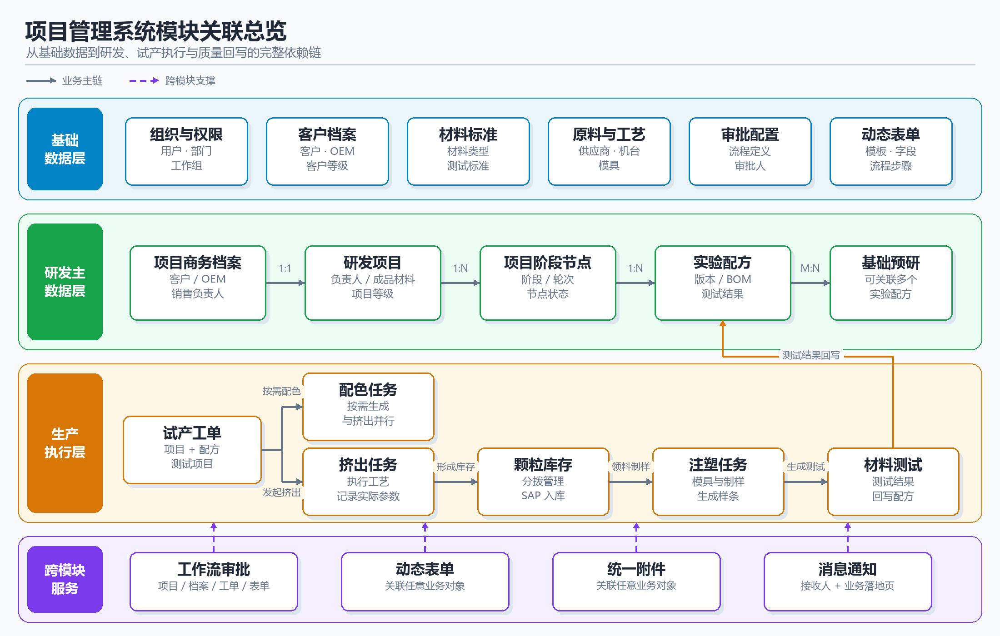
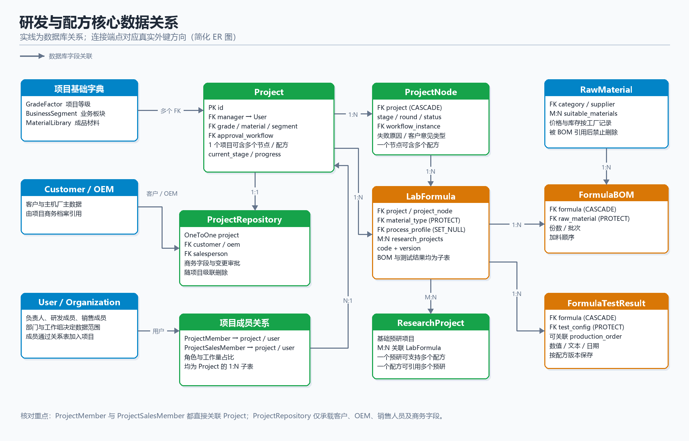
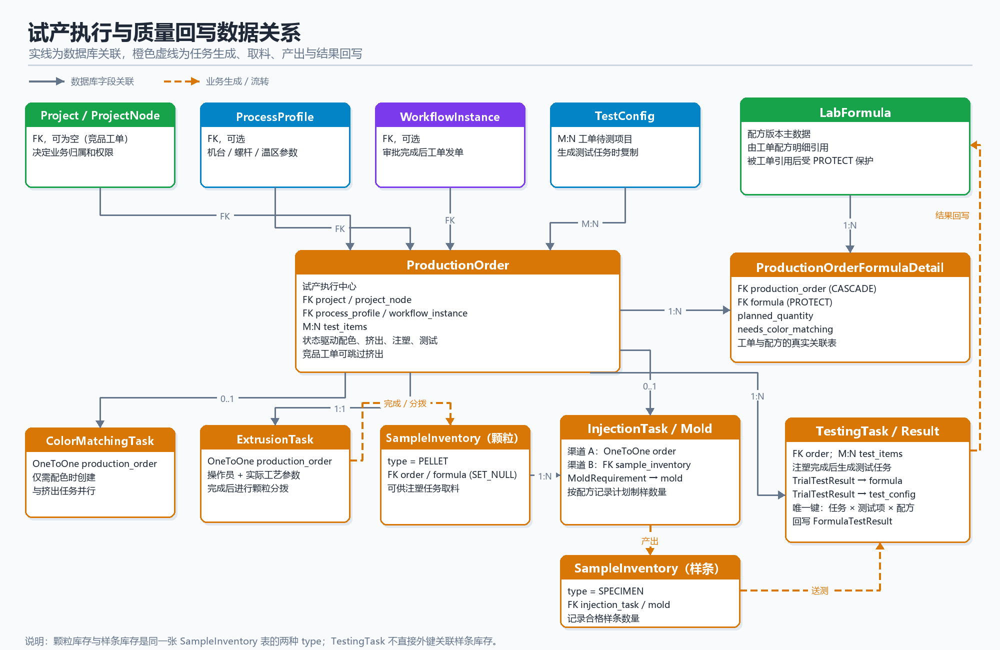
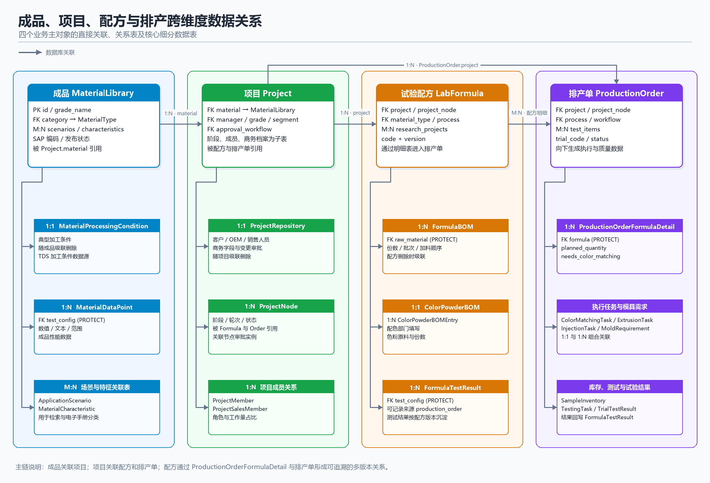

# 项目管理系统用户操作手册

> 文档版本：1.1  
> 适用系统：Django_manage 项目管理系统  
> 更新日期：2026-09-17  
> 适用对象：研发、销售、工艺、试产、配色、注塑、测试、审批及系统管理人员

---

## 目录

- [1. 手册说明](#1-手册说明)
- [2. 模块关联与数据准备](#2-模块关联与数据准备)
- [3. 快速开始](#3-快速开始)
- [4. 界面与通用操作](#4-界面与通用操作)
- [5. 权限与数据范围](#5-权限与数据范围)
- [6. 推荐业务流程](#6-推荐业务流程)
- [7. 看板工作台](#7-看板工作台)
- [8. 项目管理中心](#8-项目管理中心)
- [9. 客户档案中心](#9-客户档案中心)
- [10. 基础预研中心](#10-基础预研中心)
- [11. 材料成品库](#11-材料成品库)
- [12. 实验配方库](#12-实验配方库)
- [13. 试验排产中心](#13-试验排产中心)
- [14. 挤出排产中心](#14-挤出排产中心)
- [15. 材料配色中心](#15-材料配色中心)
- [16. 模具注塑中心](#16-模具注塑中心)
- [17. 材料测试中心](#17-材料测试中心)
- [18. 生产工艺库](#18-生产工艺库)
- [19. 原材料与供应商](#19-原材料与供应商)
- [20. 表单管理中心](#20-表单管理中心)
- [21. 流程审批中心](#21-流程审批中心)
- [22. 产品电子手册](#22-产品电子手册)
- [23. 通知与个人中心](#23-通知与个人中心)
- [24. 系统管理](#24-系统管理)
- [25. 状态速查](#25-状态速查)
- [26. 常见问题](#26-常见问题)
- [27. 操作检查清单](#27-操作检查清单)

---

## 1. 手册说明

本系统用于管理研发项目、客户档案、材料、实验配方、试验排产、配色、挤出、注塑、材料测试、动态表单及审批流程。

本手册统一使用页面上的菜单、按钮和链接描述操作入口。示例：“左侧菜单‘项目管理中心’ → ‘项目列表’ → 点击项目名称”，用户无需输入或记忆系统地址。

由于菜单和按钮按用户角色、权限等级、所属部门、工作组及数据归属动态显示，不同账号看到的内容可能不同。手册中出现但系统中未显示的入口，通常表示当前账号无权限、模块未启用或尚未配置相关基础数据。

### 1.1 使用约定

- 带 `*` 的字段为必填项。
- “保存”通常只保存当前业务数据；“提交审批”会启动工作流。
- 删除、项目终止、手动完成并回写、SAP 入库等操作可能不可逆，请先核对对象和数据。
- 列表页的筛选、分页和搜索条件一般可组合使用。
- 表格中的名称、编号或“查看”图标通常可进入详情页。
- 页面提示条和弹窗中的错误信息是处理问题的首要依据。

---

## 2. 模块关联与数据准备

本章用于回答“创建这条数据之前，系统中必须先有什么”。系统中的项目、配方、工单、任务和测试结果不是相互独立的数据；上游主数据缺失时，下游页面可能没有可选项，或者无法提交、审批和生成后续任务。

### 2.1 关系符号与使用原则

| 符号/规则 | 含义 | 业务示例 |
|---|---|---|
| `1:1` | 一条数据只对应另一条数据 | 一个研发项目对应一个项目商务档案 |
| `1:N` | 一条主数据可以对应多条明细 | 一个项目可以包含多个阶段节点和多个配方 |
| `M:N` | 两边都可以关联多条数据 | 多个配方可以关联多个基础预研项目 |
| 必须前置 | 页面保存或提交时必须存在 | 配方 BOM 使用的原材料、工单使用的配方版本 |
| 建议前置 | 系统允许暂时不选，但会影响后续处理 | 工艺方案、模具、完整的组织信息 |
| 自动生成 | 完成上一步后由系统产生 | 工单发单后生成挤出、配色、注塑或测试任务 |

数据库关系中的删除规则会直接影响页面操作：

- `PROTECT`：数据已经被业务记录引用，系统禁止直接删除，以保护历史数据。
- `SET_NULL`：删除被关联的数据后，历史记录仍保留，但对应关联会显示为空。
- `CASCADE`：删除主记录时，其专属明细同步删除，操作前必须确认影响范围。

用户不需要记忆数据库字段名。遇到下拉框无数据或删除失败时，可根据本章先检查上游数据是否已创建、启用并在当前账号的数据范围内。

### 2.2 模块依赖总览



系统数据按四层关系组织：

1. **基础数据层**：组织权限、客户/OEM、材料标准、原材料、设备工艺、审批流程和表单模板，为后续业务提供可选项。
2. **研发主数据层**：项目商务档案、研发项目、阶段节点、实验配方和基础预研构成研发过程主链。
3. **生产执行层**：试产工单根据项目和配方生成配色、挤出、注塑与材料测试任务，并形成颗粒、样条和测试结果。
4. **跨模块服务**：工作流、动态表单、附件和通知可关联多个业务模块，不独立替代业务主数据。

> 建议先完善基础数据，再创建项目和配方，最后发起试产。不要为解决“下拉框没有选项”而重复新建同名数据，应先检查权限、启用状态和数据归属。

### 2.3 研发与配方数据关系



| 主数据 | 关联数据 | 关系 | 对用户操作的影响 |
|---|---|---|---|
| 研发项目 `Project` | 项目商务档案 `ProjectRepository` | `1:1` | 客户、OEM、销售人员和商务信息通过项目档案维护 |
| 研发项目 `Project` | 项目阶段 `ProjectNode` | `1:N` | 项目推进时按阶段和轮次创建节点，配方和工单可归属具体节点 |
| 研发项目 `Project` | 项目成员 `ProjectMember` | `1:N` | 负责人、研发成员和工作量分配影响数据权限与绩效统计 |
| 研发项目 `Project` | 实验配方 `LabFormula` | `1:N` | 项目可有多个实验单号及多个配方版本 |
| 项目阶段 `ProjectNode` | 实验配方 `LabFormula` | `1:N` | 在项目阶段内创建的配方自动带入项目和节点归属 |
| 实验配方 `LabFormula` | 配方 BOM `FormulaBOM` | `1:N` | 每个配方版本分别维护原材料、份数、批次和加料顺序 |
| 原材料 `RawMaterial` | 配方 BOM `FormulaBOM` | `1:N` | 原材料被 BOM 引用后不可直接删除 |
| 实验配方 `LabFormula` | 配方测试结果 `FormulaTestResult` | `1:N` | 测试任务完成或手动回写后，结果沉淀到对应配方版本 |
| 实验配方 `LabFormula` | 基础预研 `ResearchProject` | `M:N` | 一个配方可引用多个预研成果，一个预研项目也可支持多个配方 |

新建配方前，应至少准备材料类型和原材料；若配方属于正式项目，还应先创建项目、阶段节点和项目成员。需要核算成本时，原材料还应具备相应工厂和期间的价格记录。

### 2.4 试产执行与质量回写关系



试产工单 `ProductionOrder` 是执行链中心：

1. 工单关联项目、项目阶段、一个或多个配方版本、工艺方案、测试项目和审批流程。
2. 每个选中配方形成一条工单配方明细，记录计划产量及是否需要配色。
3. 工单发单后，系统按选择生成配色任务和挤出任务；挤出完成后形成颗粒库存。
4. 需要制样时，由工单或颗粒库存进入注塑任务，结合模具和各配方制样数量形成样条库存。
5. 需要测试时，系统根据工单测试项目生成测试任务；结果按“配方版本 × 测试标准”记录，并回写配方测试结果。

工单一旦进入投产，配方版本结构和关键关联会受到限制。修改工单前应先确认当前审批、任务、库存和测试状态，避免出现执行记录与计划不一致。

### 2.5 成品、项目、配方与排产跨维度关系



这四个业务维度通过以下关系贯通：

- 成品材料 `MaterialLibrary` 被项目的 `material` 字段引用；同一成品可用于多个项目。
- 项目 `Project` 向下包含商务档案、阶段节点和成员关系；配方与排产单都可以归属项目及具体阶段节点。
- 试验配方 `LabFormula` 通过 `ProductionOrderFormulaDetail` 与排产单形成多对多业务关系，同一排产单可以选择多个配方版本，同一配方版本也可以被多个排产单引用。
- 排产单 `ProductionOrder` 除配方明细外，还向下关联配色、挤出、注塑、库存、测试任务和试验结果。

图中每个主维度下方列出了最重要的细分数据表。创建下游数据时，应沿主链向左检查成品、项目、节点和配方版本是否已存在且状态可用。

### 2.6 推荐建数顺序

首次启用系统或开展一类新业务时，建议按以下顺序准备数据：

1. **组织与权限**：子公司/基地 → 部门 → 工作组 → 用户 → 角色/权限组 → 组织角色和评审组。
2. **审批与通用配置**：流程定义 → 审批人/候选组 → 表单模板 → 通知配置。
3. **标准与分类**：材料类型 → 应用场景/特性 → 指标类别 → 测试标准 → 项目等级/业务板块。
4. **客户主数据**：客户 → OEM → 销售人员归属及项目商务字段。
5. **原材料主数据**：原材料类型 → 供应商 → 原材料 → 工厂价格/库存记录。
6. **生产资源**：机台型号 → 螺杆组合 → 工艺方案 → 模具台账。
7. **成品材料**：材料牌号 → 加工条件 → 性能数据点 → 发布资料与附件。
8. **研发业务**：项目商务档案/研发项目 → 项目成员 → 阶段节点；独立探索可先建基础预研。
9. **配方业务**：实验单号与版本 → 原材料 BOM → 色粉 BOM → 初始测试结果。
10. **试产执行**：试产工单 → 审批发单 → 配色/挤出 → 颗粒分拨 → 注塑 → 测试 → 结果回写。

### 2.7 各模块前置数据矩阵

| 模块 | 准备/创建对象 | 必须先有 | 建议先有 | 后续关联或自动数据 |
|---|---|---|---|---|
| 看板工作台 | 统计和待办视图 | 用户账号及模块权限 | 完整部门、工作组和业务归属 | 汇总项目、工单、流程、通知等数据 |
| 项目管理中心 | 研发项目 | 项目负责人、项目等级、成品材料 | 业务板块、审批流程、客户/OEM、项目成员 | 项目档案、阶段节点、配方、工单、绩效 |
| 客户档案中心 | 客户、OEM、项目档案 | 有权限的销售/管理账号 | 客户等级、销售负责人、审批流程 | 被项目、竞品工单和商务分析引用 |
| 基础预研中心 | 预研项目 | 负责人和组织归属 | 成员、阶段标准、附件/表单模板 | 可与多个实验配方关联 |
| 材料成品库 | 成品材料 | 材料类型 | 应用场景、特性、测试标准、加工条件 | 项目选材、性能数据、TDS、电子手册发布 |
| 实验配方库 | 配方版本和 BOM | 材料类型、原材料 | 项目/节点、工艺方案、预研项目、原料价格 | 工单配方明细、色粉 BOM、成本与测试结果 |
| 试验排产中心 | 试产工单 | 项目、阶段节点、配方版本 | 工艺方案、测试标准、模具、审批流程 | 配色/挤出/注塑/测试任务及库存 |
| 挤出排产中心 | 挤出执行记录 | 已发单的试产工单 | 操作员、机台、螺杆、工艺参数 | 颗粒库存、分拨记录和后续注塑取料 |
| 材料配色中心 | 配色任务/色粉 BOM | 工单配方已标记“需要配色” | 色粉原材料和配色人员 | 配色完成状态与配方色粉 BOM |
| 模具注塑中心 | 注塑任务 | 试产工单或可用颗粒库存 | 模具、各配方制样数量、注塑参数 | 样条库存和材料测试任务 |
| 材料测试中心 | 测试任务与结果 | 工单、配方、测试标准 | 合格样条、测试负责人、测试日期 | 试验结果并回写配方测试结果 |
| 生产工艺库 | 工艺方案 | 机台型号、螺杆组合 | 适用材料类型、温区和速度参数 | 被配方和试产工单引用 |
| 原材料/供应商 | 原材料 | 原材料类型、供应商 | 适用材料类型、工厂、价格和库存 | 配方 BOM、成本计算和 SAP 数据 |
| 表单管理中心 | 表单提交 | 已启用的表单模板及字段 | 分步配置、审批流程、业务对象 | 草稿、提交记录、审批实例和附件 |
| 流程审批中心 | 流程实例/任务 | 已启用的流程定义 | 审批人、候选组、组织角色 | 待办、已办、状态回写和通知 |
| 产品电子手册 | 对外材料目录 | 已发布的成品材料 | 中英文名称、TDS/SDS、分类与性能数据 | 面向外部会员的检索、详情和下载 |
| 通知与个人中心 | 通知和个人资料 | 用户账号 | 正确邮箱、组织及角色信息 | 接收审批、任务和业务变更提醒 |
| 系统管理 | 权限与基础配置 | 超级管理员或相应管理权限 | 变更方案和影响范围确认 | 影响菜单、数据范围、审批和全模块选项 |

### 2.8 常用场景前置检查

**新建研发项目**

- [ ] 项目负责人账号已启用，且所属子公司、部门和工作组正确
- [ ] 项目等级、业务板块和目标成品材料已维护
- [ ] 客户和 OEM 已存在，销售负责人可选
- [ ] 项目审批流程已启用并配置审批人
- [ ] 计划加入的研发/销售成员已获得相应数据权限

**新建实验配方**

- [ ] 材料类型已维护
- [ ] 所需原材料、类别和供应商已维护
- [ ] 需要归属正式研发时，项目及当前阶段节点已创建
- [ ] 需要引用工艺时，机台、螺杆和工艺方案已维护
- [ ] 需要显示成本时，原材料价格、工厂和有效期间已维护

**新建试产工单**

- [ ] 项目、节点、实验单号和配方版本状态可用
- [ ] 各配方版本计划产量及配色需求已确认
- [ ] 工艺方案和操作员可选
- [ ] 所需模具存在且状态可用，制样数量已确认
- [ ] 测试标准已维护并完成选择
- [ ] 工单审批流程和审批人配置有效

**完成测试并发布材料**

- [ ] 注塑已形成可用样条，或已确认测试样品来源
- [ ] 测试任务中的配方版本和测试项目正确
- [ ] 测试值、单位、日期及备注已复核并回写
- [ ] 成品材料已关联正确的性能数据点和加工条件
- [ ] TDS/SDS 等附件及中英文发布信息完整

### 2.9 删除与变更影响

| 操作对象 | 可能影响 | 建议处理方式 |
|---|---|---|
| 原材料 | 已被配方 BOM 引用时受 `PROTECT` 保护，不能直接删除 | 停用或标记失效；新配方改用替代原料 |
| 配方版本 | 已被工单配方明细引用时受保护，投产后还可能被业务锁定 | 保留历史版本，新建版本进行调整 |
| 测试标准 | 已形成配方测试结果时受保护 | 停用旧标准并新建标准，不覆盖历史定义 |
| 项目/节点 | 关联配方、工单、成员、审批和绩效数据 | 优先终止或关闭，不直接删除正式项目 |
| 客户/OEM/负责人等可选关联 | 部分关系允许置空，历史记录仍保留 | 变更前先确认报表和责任归属是否受影响 |
| 项目专属明细 | 部分明细随主记录级联删除 | 删除草稿主记录前查看明细、附件和审批状态 |
| 流程定义、表单模板 | 新业务可能无法提交，历史实例仍需保留 | 已使用配置应停用并新建版本，避免直接删除 |

正式业务数据通常应通过“停用、下架、终止、作废或新建版本”处理。只有确认数据未被引用且属于测试/草稿时，才执行删除；页面提示存在关联时，应停止操作并联系管理员核对。

---

## 3. 快速开始

### 3.1 登录系统

操作入口：`打开管理员提供的系统地址，系统会自动显示登录页。`

1. 输入注册邮箱。
2. 输入密码。
3. 输入图形验证码；看不清时点击验证码图片刷新。
4. 如需在当前设备保持会话，勾选“在此设备上保持登录”。
5. 点击“登录”。

管理后台仅允许内部成员账号登录。客户或主机厂会员应使用产品电子手册入口，不能登录内部管理系统。

若连续多次登录失败，账号会被临时锁定。请等待页面提示的锁定时间结束后再试，不要持续重复提交。

### 3.2 注册账号

操作入口：`在登录页底部点击“立即注册”。`

1. 点击登录页的“立即注册”。
2. 填写用户名、邮箱和密码。
3. 输入管理员提供的邀请码。
4. 按页面要求完成验证码验证并提交。

若页面提示“系统暂未开放注册”，请联系管理员创建账号或开启邀请码注册。

### 3.3 忘记密码

操作入口：`在登录页“密码”右侧点击“忘记密码？”。`

1. 输入注册邮箱。
2. 输入图形验证码。
3. 点击“发送验证码”，到邮箱查收验证码。
4. 输入邮箱验证码、新密码和确认密码。
5. 点击“重置密码”。

邮箱验证码发送频率为同一邮箱或同一 IP 每 60 秒一次。

### 3.4 首次登录建议

1. 打开右上角用户菜单，进入“个人中心”。
2. 检查姓名、部门、子公司/基地、角色和工作组是否正确。
3. 进入“个人工作台”，查看待办任务和已发起流程。
4. 打开右上角通知铃铛，处理未读消息。
5. 若菜单缺失或数据不可见，记录页面地址和业务对象编号后联系管理员。

---

## 4. 界面与通用操作

### 4.1 左侧导航

左侧导航按权限动态展示，主要包括：

| 菜单 | 主要用途 |
|---|---|
| 看板工作台 | 个人任务、系统统计、项目全景和客户行为分析 |
| 项目管理中心 | 项目、阶段节点、成员、绩效及项目配置 |
| 客户档案中心 | 客户、客户排行、主机厂及项目档案 |
| 基础预研中心 | 独立预研项目和阶段推进 |
| 材料成品库 | 成品材料、性能指标和分类配置 |
| 实验配方库 | 配方 BOM、成本、测试结果及对比 |
| 试验排产中心 | 试产工单、库存和排产日历 |
| 挤出排产中心 | 排产工作台和挤出任务 |
| 材料配色中心 | 配色任务和项目配色 BOM |
| 模具注塑中心 | 注塑任务、样品库存和模具台账 |
| 材料测试中心 | 测试任务、结果填写及回写 |
| 生产工艺库 | 工艺方案、机台型号和螺杆组合 |
| 原材料/供应商 | 原材料、类型和供应商资料 |
| 表单管理中心 | 动态表单、草稿和提交记录 |
| 流程审批中心 | 待办、已办、我发起的流程和流程定义 |
| 系统管理设置 | 仅管理员使用的系统配置与底层管理 |

移动端可点击左上角菜单按钮展开或收起导航。

### 4.2 顶部工具栏

- **搜索框**：用于搜索项目等业务信息；复杂查询建议进入对应模块列表使用筛选器。
- **配方对比清单**：仅对有相应研发权限的用户显示，可集中对比所选配方。
- **深色/浅色模式**：切换页面显示主题。
- **通知铃铛**：显示未读数量和最近消息。
- **用户菜单**：进入个人中心或退出登录。

### 4.3 列表页

常见操作方式：

1. 在搜索框输入名称、编码或关键词。
2. 选择状态、分类、负责人、日期等筛选条件。
3. 点击“筛选/搜索”。
4. 点击“重置”清空条件。
5. 使用底部分页切换记录。
6. 点击记录名称或操作列图标查看详情、编辑或复制。

### 4.4 表单页

- 下拉搜索框支持输入关键词后选择，不要只输入文本而未选中结果。
- 多选字段可选择多个标签，点击标签上的移除按钮可取消。
- 日期和时间字段按浏览器日期控件选择。
- 动态明细行可新增或删除；删除已有行后必须提交整个表单才会生效。
- 保存失败时，先查看页面顶部和具体字段下方的红色错误提示。

### 4.5 附件

项目、材料、表单等页面可能显示统一附件面板。

1. 点击上传按钮或将文件拖入上传区域。
2. 等待上传完成并确认文件出现在列表中。
3. 点击文件名下载；支持的 CAD 文件可使用预览按钮。
4. 删除附件前确认文件未被其他流程或同事使用。

附件上传、下载和删除都受业务对象权限控制。上传失败时检查文件大小、类型和当前对象是否允许编辑。

---

## 5. 权限与数据范围

系统采用多层权限控制：

| 层级 | 含义 | 常见表现 |
|---|---|---|
| 角色准入 | 当前角色是否允许进入模块 | 左侧菜单不显示或访问后提示无权限 |
| 等级准入 | 用户等级是否达到模块最低要求 | 能看到菜单但无法进入受限功能 |
| 操作权限 | 是否拥有查看、新增、修改或删除权限 | 详情可见，但新增/编辑/删除按钮不显示 |
| 部门隔离 | 只能查看允许部门的数据 | 列表记录比其他同事少 |
| 工作组隔离 | 只能查看所属工作组的数据 | 同部门不同工作组看到的数据不同 |
| 对象权限 | 是否为负责人、成员、审批人或创建人 | 只能编辑自己负责的项目或任务 |

超级管理员通常可绕过业务准入限制。普通用户遇到 `403` 或“权限不足”时，应联系管理员核对以下信息：

- 用户角色与等级；
- 所属子公司、部门和工作组；
- Django 用户组及具体权限码；
- 业务对象的负责人、协同成员或审批人；
- 模块是否已启用并配置允许角色。

不要借用他人账号处理业务。审批、回写和状态变更会记录实际操作人。

---

## 6. 推荐业务流程

### 6.1 新产品研发主流程

```text
维护客户/OEM与基础资料
        ↓
创建研发项目并配置负责人、研发成员、销售成员
        ↓
推进当前项目阶段，创建实验配方与版本
        ↓
从配方/项目发起试产工单，配置产量、工艺、配色、模具和测试项
        ↓
提交审批 → 审批通过/发单
        ↓
排产工作台安排挤出时间和操作员
        ↓
开始挤出 → 填写实际工艺记录 → 完成挤出
        ↓
颗粒分拨：成品库存 / 注塑 / 其他用途
        ↓
需要配色时填写配色 BOM
        ↓
开始并完成注塑，生成样条库存
        ↓
填写材料测试结果并回写配方
        ↓
项目节点提交审批并推进下一阶段
```

### 6.2 客户竞品流程

```text
项目配方过程页创建竞品工单
        ↓
填写竞品公司、品牌、型号和客户信息
        ↓
系统标记“跳过挤出”
        ↓
审批通过后直接进入注塑
        ↓
注塑制样 → 材料测试 → 结果回写竞品配方
```

### 6.3 操作原则

- 项目阶段是研发过程的主线，配方、工单、表单和附件尽量关联到正确项目节点。
- 先维护原材料、工艺、模具和测试标准，再创建工单，可减少临时补录。
- 工单一旦进入挤出或后续阶段，关联实验单会被整体锁定；修改前务必确认工单状态。
- 测试结果正常应先完整填写再“回写配方”；“手动完成并回写”只用于确认缺项不再补录的特殊情况。

---

## 7. 看板工作台

### 7.1 首页

操作入口：`登录后默认进入首页；也可点击左侧菜单“首页”或左上角系统名称返回首页。`

首页提供系统入口和功能概览。点击“进入个人工作台”进入个人业务中心。

### 7.2 个人工作台

操作入口：`点击左侧菜单“看板工作台” → “个人工作台”；也可在首页点击“进入个人工作台”。`

个人工作台按权限汇总：

- 我负责或参与的项目；
- 我的表单草稿；
- 我提交的表单；
- 待办审批任务；
- 已办任务；
- 我发起的流程。

点击任一记录可进入对应项目、表单或流程详情。建议每天登录后优先查看待办任务和异常状态。

### 7.3 系统总览

操作入口：`点击左侧菜单“看板工作台” → “系统总览”。`

查看系统级业务汇总。仅拥有相应查看权限的用户可访问。

### 7.4 项目看板

- 项目全景看板：点击左侧菜单“看板工作台” → “项目全景看板”。
- 项目统计看板：点击左侧菜单“看板工作台” → “项目统计看板”。

可查看项目数量、阶段分布、进展、负责人负载和风险项目。统计页支持条件筛选和重置。

### 7.5 客户行为分析

操作入口：`点击左侧菜单“看板工作台” → “客户行为分析”。`

用于查看电子手册中的产品浏览、资料下载等客户行为。需要客户资料查看权限。

---

## 8. 项目管理中心

### 8.1 项目列表

操作入口：`点击左侧菜单“项目管理中心” → “项目列表”。`

项目列表用于按关键词、负责人、阶段、所属组和日期等条件查找项目。点击项目名称进入详情。

### 8.2 创建项目

操作入口：`点击左侧菜单“项目管理中心” → “项目列表” → 页面右上角“新建项目”。`

1. 点击“新建项目”。
2. 填写项目名称；项目编码可留空由系统自动生成。
3. 选择项目负责人、项目等级、成品材料和业务板块。
4. 填写项目描述。
5. 选择默认审批流程（页面提供时）。
6. 保存项目。

创建后系统会建立标准项目阶段。建议立即进入项目详情维护协同成员和销售成员。

### 8.3 项目阶段

标准研发阶段如下：

1. 项目立项；
2. 研发阶段；
3. 客户小试；
4. 客户中试；
5. 客户量产下单；
6. 开发周期完成。

另有两个不计入标准进度百分比的节点：

- **量产过程跟踪**：默认存在，用于量产后的持续跟踪，不能直接设为“已完成”。
- **客户意见**：按需插入，记录客户反馈或终止原因。

节点常见状态为未开始、进行中、暂停、待审批、已完成、异常/节点迭代和已终止。

### 8.4 更新节点

1. 进入项目详情。
2. 找到当前活动节点。
3. 点击更新或状态操作按钮。
4. 选择未开始、进行中、暂停或已完成。
5. 填写备注/批注。
6. 提交。

如果项目配置了节点审批流程，将节点设为完成可能先进入“待审批”，审批通过后才正式完成并推进下一节点。

### 8.5 异常与迭代

研发、小试、中试和量产跟踪阶段可申报异常。

1. 在当前节点点击“申报异常”。
2. 选择不合格原因。
3. 填写详细原因。
4. 确认提交。

系统会将当前节点标记为异常，并按阶段自动插入新的研发、小试或中试迭代节点。请勿在不了解后续节点变化的情况下重复提交。

### 8.6 客户意见与项目终止

1. 在当前节点点击客户反馈操作。
2. 选择客户意见类型。
3. 填写反馈内容。
4. 选择继续跟进或终止项目。

选择终止后，系统会删除后续尚未开始的节点并记录终止原因。此操作会改变整个项目生命周期，提交前应完成内部确认。

### 8.7 项目信息编辑审批

编辑项目名称、等级、材料、业务板块或描述时：

1. 点击项目详情中的“编辑”。
2. 修改字段。
3. 填写“提交意见”，说明变更原因。
4. 提交审批。
5. 在项目详情的变更记录中跟踪待审批、已通过或已拒绝状态。

审批通过前，正式项目信息不会被替换。同一项目已有进行中的信息变更审批时，通常不能再次发起。

### 8.8 项目成员

项目成员分为研发协同成员和销售成员两套独立工作量池。

研发协同角色包括项目主导、实验研发、工艺支持、商务跟进和辅助/资料。

操作步骤：

1. 进入项目详情。
2. 点击成员管理或销售成员管理。
3. 选择用户、成员角色和工作量占比。
4. 保存。

工作量占比用于绩效分摊。调整成员或占比会影响成绩快照，应按实际贡献维护。

### 8.9 项目配方过程

操作入口：`点击左侧菜单“项目管理中心” → “项目列表” → 点击项目名称 → 在项目详情点击“配方过程”。`

该页面用于集中查看当前项目各阶段、各轮次的配方、测试结果和生产工单，并可：

- 新增实验配方；
- 创建竞品工单；
- 查看不同版本配方；
- 查看工单进度；
- 在配方锁定后通过“均值回写”补录允许的测试数据。

### 8.10 项目表单与报告

- 项目表单：进入项目详情后，点击“项目表单/表单记录”。
- 导出项目报告：进入项目详情后，点击“导出报告”。

项目表单页按项目级和节点级展示动态表单。只有具备内容管理权限的用户才能新建或上传相关内容。

### 8.11 项目绩效

- 成员绩效看板：点击左侧菜单“项目管理中心” → “成员绩效看板”。
- 项目评分规则：点击左侧菜单“项目管理中心” → “项目评分规则”。

绩效看板按研发轨和销售轨展示成员成绩。成绩由节点状态、项目等级因子、工作量占比及评分规则共同计算。

评分规则、项目等级因子、业务板块、不合格原因和客户意见类型通常由管理员或业务负责人维护，普通用户不要随意修改。

---

## 9. 客户档案中心

### 9.1 客户资料库

操作入口：`点击左侧菜单“客户档案中心” → “客户资料库”。`

可按客户名称、关联主机厂、业务员、研发部门等条件查询。点击客户进入详情，查看基本资料、关联项目及业务信息。

新增客户：

1. 点击“新增客户”。
2. 填写客户基本信息和联系人信息。
3. 选择关联主机厂、负责人员等资料。
4. 保存。

### 9.2 客户评分排行

操作入口：`点击左侧菜单“客户档案中心” → “客户评分排行”。`

查看客户评分和排序，用于客户价值分析。评分来源和权重以系统实际配置为准。

### 9.3 主机厂（OEM）库

操作入口：`点击左侧菜单“客户档案中心” → “主机厂（OEM）库”。`

用于维护 OEM 基本信息并查看其关联客户和项目。支持新增、详情查看和编辑。

### 9.4 项目档案

项目档案从项目详情进入，用于维护更完整的客户、车型、预计订单等项目资料。

编辑档案时必须填写提交意见。变更需审批通过后才写入正式档案，并保留永久变更记录。

---

## 10. 基础预研中心

操作入口：`点击左侧菜单“基础预研中心” → “预研项目管理”。`

基础预研项目与商业项目相互独立，适用于材料机理、技术储备或前瞻研究。

### 10.1 创建预研项目

1. 点击“新建预研项目”。
2. 填写项目名称、负责人、所属组和描述等信息。
3. 保存；项目编号可由系统自动生成。

系统会创建六个标准阶段：项目立项、文献/市场调研、方案制定、实验验证、结果分析、结项/归档。

### 10.2 推进预研节点

1. 进入预研项目详情。
2. 找到当前活动节点。
3. 更新状态和备注。
4. 实验阶段失败时，可申报失败并自动新增下一轮实验节点。

预研项目可关联实验配方，便于把研究成果沉淀到配方库。

---

## 11. 材料成品库

### 11.1 成品材料列表

操作入口：`点击左侧菜单“材料成品库” → “成品材料列表”。`

支持按牌号、名称、类型、应用场景、特征和常用性能范围筛选。点击材料牌号进入详情。

详情页通常包括：

- 材料基本信息、分类、阻燃等级、颜色；
- SAP 物料号；
- 应用场景和材料特征；
- 物性测试数据及允许范围；
- 典型加工条件；
- 关联项目和成熟配方；
- 附件、TDS 及发布状态。

### 11.2 新增材料

操作入口：`点击左侧菜单“材料成品库” → “成品材料列表” → 页面右上角“新增材料”。`

1. 填写牌号、中文/英文名称、制造商、材料类型和描述。
2. 填写 SAP 物料号；该字段会用于样品分拨时自动预填。
3. 选择应用场景和特征属性。
4. 填写颜色名称、潘通色号和 RGB 色值（如适用）。
5. 在性能数据区域新增测试项，填写典型值、最小值、最大值和备注。
6. 填写典型加工条件。
7. 决定是否开启“对外发布”。
8. 保存。

性能值输入方式由测试标准的数据类型决定：数值型填数字，文本型填文本，选择型必须从预设选项中选择；数值型最小值不能大于最大值。

### 11.3 导入已有材料数据

- 新建材料前可通过“导入数据”选择来源材料并预填。
- 编辑材料时可从另一材料导入并替换相关数据。

导入会影响当前表单内容。提交前逐项核对基本信息、物性和加工条件。

### 11.4 发布与下架

列表页支持批量发布或下架。仅“对外发布”的材料会显示在产品电子手册中。

发布前检查：

- 名称、牌号和分类正确；
- 对外可见的物性数据完整；
- TDS/SDS 等资料已上传；
- 不含内部备注、成本或敏感信息。

### 11.5 导出 TDS

在材料详情点击 TDS 导出。若填写了英文名称，可生成中英文内容；英文名称为空时通常只显示中文。

### 11.6 基础分类配置

| 配置项 | 入口 | 用途 |
|---|---|---|
| 材料类型 | 左侧菜单“材料成品库” → “材料类型分类” | 材料归类 |
| 材料特性 | 左侧菜单“材料成品库” → “材料特性分类” | 材料标签与检索 |
| 应用场景 | 左侧菜单“材料成品库” → “应用场景分类” | 应用领域与需求 |
| 测试分类 | 左侧菜单“材料成品库” → “测试分类” | 物性指标分组及排序 |
| 测试标准 | 左侧菜单“材料成品库” → “测试标准配置” | 指标名称、标准、条件、单位和数据类型 |

修改测试标准会影响材料录入、工单测试项和测试结果填写，应由指定人员维护。

---

## 12. 实验配方库

### 12.1 配方列表

操作入口：`点击左侧菜单“实验配方库” → “实验配方列表”。`

可按实验单号、配方名称、材料类型、项目等条件查询。列表展示版本、工艺、成本和成熟/竞品标记等信息。

### 12.2 新增配方

1. 从项目当前节点点击“新增配方”，可自动带入项目和阶段信息；或在配方列表点击“新增配方”。
2. 选择从现有配方导入，或选择“从空白开始”。
3. 填写配方基本信息、材料类型、关联项目/节点和工艺方案。
4. 在 BOM 中逐行选择原材料并填写份数。
5. 填写测试结果或其他说明。
6. 按需要创建多个版本。
7. 保存。

同一批次的多个版本共享实验单号，以版本号区分。量产意向或量产跟踪阶段可将配方标记为成熟配方。

### 12.3 BOM 与成本

- BOM 份数用于计算原材料比例。
- 系统结合原材料最近价格记录计算预测成本和近 N 月均价。
- 详情页可查看不同工厂的成本及价格趋势。
- 若成本为空，请检查原材料是否有有效价格记录和工厂配置。

### 12.4 配方编辑限制

关联生产工单后，配方按工单最靠后的状态分级锁定：

| 级别 | 工单状态 | 允许操作 |
|---|---|---|
| L1 | 草稿等早期状态 | 可编辑基础信息/BOM，也可增删版本 |
| L2 | 审批中或已发单 | 可编辑基础信息/BOM，但不能增删版本 |
| L3 | 已进入挤出或之后 | 整个实验单只读 |

页面出现“版本结构已冻结”或“已整体锁定”提示时，请按提示操作。投产后的测试补录应使用项目配方过程页的“均值回写”，不要尝试绕过锁定。

只有草稿或已取消工单可在版本变更时自动解除/调整关联；其他状态的工单会阻止删除被引用版本。

### 12.5 配方对比

1. 在配方列表勾选记录并点击加入对比，或在详情页加入对比清单。
2. 点击顶部配方对比图标。
3. 选择表格对比或图表对比。
4. 对比 BOM、物性、成本等差异。
5. 完成后从清单移除无关配方。

配方对比功能仅对具备相应研发准入权限的用户显示。

### 12.6 客户竞品配方

竞品配方由项目配方过程中的竞品工单自动创建，带“客户竞品”标识，并跳过挤出环节。请在竞品工单中完整填写公司、品牌、型号和客户，便于追溯。

---

## 13. 试验排产中心

### 13.1 排产总览

操作入口：`点击左侧菜单“试验排产中心” → “排产总览”。`

用于查看试产工单总体数量、状态和待处理事项，并进入工单创建、详情和相关任务。

### 13.2 创建生产工单

操作入口：`进入项目详情 → 点击“配方过程” → 选择实验单/配方版本后点击“创建工单”；也可在“试验排产中心”的排产总览中点击“新建工单”。`

主要填写内容：

- 关联项目和项目节点；
- 实验单号及配方版本；
- 每个配方版本的计划产量；
- 工艺方案、挤出操作员；
- 包装说明和存放位置；
- 干燥温度、干燥时间、内膜袋密封；
- 各版本是否需要配色；
- 注塑温度、注塑前处理；
- 模具及各版本计划制样数量；
- 后续测试项目；
- 备注。

竞品工单会启用“跳过挤出”，并要求竞品公司、品牌、型号和客户等信息。

### 13.3 工单状态与操作

生产工单的正常状态顺序：

```text
草稿 → 流程中 → 已发单 → 挤出中 → 注塑中 → 测试中 → 已完成
```

“已排产”“挤出完成”“颗粒已分拨”是排产或子任务的过程里程碑，不是生产工单的独立状态；取消工单显示“已取消”。可执行操作取决于工单和子任务状态：

- 草稿：编辑、删除、提交审批；
- 审批通过/已发单：安排挤出排产；
- 已安排排期且任务待生产：开始挤出；
- 挤出中：填写运行记录并完成；
- 挤出任务完成：进行颗粒分拨；
- 后续任务：进入配色、注塑或测试中心处理。

### 13.4 提交审批与发单

1. 在工单详情确认配方、产量、工艺、模具和测试项。
2. 点击“提交审批/启动流程”。
3. 到“我发起的流程”查看审批进度。
4. 审批通过后工单进入已发单状态。

若未配置审批流程或当前业务允许直接发单，页面可能显示直接启动后续生产的操作。

### 13.5 打印工单

操作入口：`进入“试验排产中心” → 打开对应工单详情 → 点击“打印工单”。`

打印前使用浏览器打印预览检查纸张、缩放和分页。

### 13.6 排产日历

操作入口：`点击左侧菜单“试验排产中心” → “排产日历”。`

用于只读查看已安排的挤出任务、时间和操作员。实际排期调整请使用挤出排产工作台。

### 13.7 成品颗粒库存

操作入口：`点击左侧菜单“试验排产中心” → “成品颗粒库存”。`

可按实验单号查看样品批次、配方版本、数量、存放位置及库存状态。点击批次进入详情。

库存状态包括在实验房、已入 SAP 仓库和已消耗。

### 13.8 SAP 入库

1. 在颗粒样品详情点击 SAP 入库。
2. 核对 SAP 物料号、批次号、入库日期和库位。
3. 提交。

SAP 物料号通常从项目关联成品材料自动预填。若为空或错误，应先核对材料主数据。入库属于正式库存操作，提交前确认批次与数量一致。

---

## 14. 挤出排产中心

### 14.1 排产工作台

操作入口：`点击左侧菜单“挤出排产中心” → “排产工作台”。`

工作台展示待排工单和时间轴/日历。常见操作：

1. 从待排工单区域选择工单。
2. 拖放到目标日期和时间段，或使用排产操作填写开始、结束时间。
3. 选择/确认挤出操作员。
4. 保存排期。
5. 若需调整，移动排期或执行取消排产后重新安排。

排产前确认机台、工艺方案和物料准备情况，避免同一人员或设备时间冲突。

### 14.2 挤出任务

操作入口：`点击左侧菜单“挤出排产中心” → “挤出任务”。`

任务状态包括待生产、挤出中和已完成。

### 14.3 开始挤出

1. 进入挤出任务详情。
2. 核对工单、实验单、配方、计划产量和工艺方案。
3. 点击“开始生产/开始挤出”。

开始后会记录操作员和开始时间，并使关联配方进入严格锁定状态。

### 14.4 填写挤出记录

点击“填写记录”，录入实际运行参数，常见字段包括：

- 各温区温度；
- 主机转速和扭矩；
- 喂料速度、侧喂料速度；
- 熔体压力和实测温度；
- 真空、过滤网、料条、冷却水及风刀参数；
- 实际产量和异常备注。

应填写实际值，不要直接照抄计划工艺。过程参数将用于质量追溯和工艺复盘。

### 14.5 完成与颗粒分拨

1. 确认实际产量和过程记录完整。
2. 点击完成挤出。
3. 进入“颗粒分拨”。
4. 按配方版本分配成品库存、注塑用料等数量。
5. 填写包装说明和存放位置。
6. 确认各项分配总量与实际产量一致后提交。

颗粒分拨完成后会生成或更新样品库存，并触发后续注塑任务。分拨完成标记不应在数量未核对时提前提交。

---

## 15. 材料配色中心

### 15.1 配色任务

操作入口：`点击左侧菜单“材料配色中心” → “配色任务”。`

列表展示工单中勾选“需要配色”的配方版本。点击“配色”进入项目配色页，点击详情可查看相关项目和配方。

### 15.2 项目配色

操作入口：`点击左侧菜单“材料配色中心” → “产品项目” → 点击项目名称；也可从“配色任务”点击对应任务的“配色”。`

1. 选择项目阶段、轮次和配方版本。
2. 查看基础配方 BOM。
3. 录入色粉/色母及用量，形成配色 BOM。
4. 可使用历史配方或成熟配方作为参考对比。
5. 点击保存。

页面提供全局或当前阶段对比视图。保存时若系统提示覆盖，确认当前版本是否已有配色数据，再决定取消或覆盖。

配色数据与具体配方版本关联。切换版本后必须再次核对页面标题和版本号，避免写入错误版本。

---

## 16. 模具注塑中心

### 16.1 注塑任务

操作入口：`点击左侧菜单“模具注塑中心” → “注塑任务”。`

注塑任务有两种来源：

- **排产工单产出**：由试产工单及颗粒分拨触发；
- **样品库取料**：从已有颗粒库存独立注塑，例如竞品分析。

任务状态为待生产、注塑中和已完成。

### 16.2 开始注塑

1. 进入任务详情。
2. 核对颗粒来源、项目、配方版本、模具需求和计划制样数量。
3. 检查模具状态必须为可用。
4. 点击“开始注塑”。

### 16.3 完成注塑

1. 填写注塑工艺备注和完成备注。
2. 按模具和配方版本确认实际样条数量、合格数量等信息。
3. 点击完成。

完成后系统会生成样条库存；工单已选择测试项目时，还会形成后续材料测试任务。

### 16.4 样品库存

操作入口：`点击左侧菜单“模具注塑中心” → “样品库存”。`

可查看待注塑颗粒及注塑后样条，包含来源工单、配方、模具、数量、批次和状态等信息。

### 16.5 模具台账

操作入口：`点击左侧菜单“模具注塑中心” → “模具台账”。`

维护内容包括：

- 模具名称和唯一编号；
- 模具类型：测试样条、成品、原型、工装夹具或其他；
- 标准：ISO、ASTM、GB 或其他；
- 样条描述和模腔数量；
- 状态：可用、维护中、已退役；
- 备注。

维护中或已退役模具不应安排新任务。编号必须唯一。

---

## 17. 材料测试中心

### 17.1 测试任务

操作入口：`点击左侧菜单“材料测试中心” → “测试任务”。`

测试任务通常由注塑完成后自动创建，关联生产工单、实验单、配方版本和工单中选择的测试项目。

状态包括待测试、测试中、已完成和已回写。

### 17.2 填写测试结果

1. 进入测试任务详情。
2. 点击“填写结果”。
3. 在“测试项 × 配方版本”矩阵中逐格填写。
4. 数值型指标填写数值；文本型填写文字；选择型从预设选项选择。
5. 填写测试日期和必要备注。
6. 保存。

同一工单有多个配方版本时，每一列对应一个版本。填写前确认列头版本号，避免串写。

### 17.3 回写配方

当结果满足任务要求后：

1. 在详情页复核所有测试项和版本。
2. 点击“回写配方”。
3. 确认系统显示“已回写”。
4. 到配方详情或项目配方过程页复核结果。

回写会把试产测试中间结果写入正式配方测试结果，是质量数据的正式落库动作。

### 17.4 手动完成并回写

当部分测试项确认无法提供且业务决定结束任务时，可点击“手动完成并回写”。系统会结束任务并仅回写已填写的数据。

此操作可能造成配方测试项不完整，必须在业务负责人确认后使用，并在备注中说明缺失原因。

### 17.5 样条库存

操作入口：`点击左侧菜单“材料测试中心” → “样条库存”。`

查看待测试和已测试样条，包含批次、配方版本、模具、合格数量和状态。测试前核对样条标签与系统批次一致。

---

## 18. 生产工艺库

### 18.1 工艺方案

操作入口：`点击左侧菜单“生产工艺库” → “工艺方案列表”。`

工艺方案可关联适用材料、机台和螺杆组合，保存温区、转速、扭矩、压力、冷却、过滤及 QC 要点等标准参数。

新增步骤：

1. 点击新增工艺方案。
2. 填写方案名称和工艺类型。
3. 选择适用材料、机台和螺杆组合。
4. 填写标准参数及 QC 检查/更换要点。
5. 保存。

可从详情复制副本，再修改为新方案。复制后务必修改名称及实际差异，避免多个方案难以区分。

### 18.2 机台型号

操作入口：`点击左侧菜单“生产工艺库” → “机台型号管理”。`

维护品牌、型号、螺杆直径、长径比等机台基础信息。型号必须与现场标识一致。

### 18.3 螺杆组合

操作入口：`点击左侧菜单“生产工艺库” → “螺杆组合管理”。`

维护组合名称、组合号、适用机台及排列逻辑。建议名称包含基材、功能和版本，便于工单选择。

---

## 19. 原材料与供应商

### 19.1 原材料列表

操作入口：`点击左侧菜单“原材料/供应商” → “原材料列表”。`

可按名称、型号、内部编码、类型、供应商和适用材料等条件查询。

详情包括：

- 原材料名称、型号、内部物料编码；
- 分类、供应商和使用方法；
- 性能指标与测试日期；
- 最新价格、分厂价格及价格趋势；
- SAP 库存和安全库存；
- 被配方使用情况。

### 19.2 新增原材料

1. 填写名称、型号和内部物料编码。
2. 选择原材料类型和供应商。
3. 选择适用成品材料。
4. 填写采购/使用信息和说明。
5. 新增性能指标并填写值、范围、日期和备注。
6. 保存。

价格不在普通原材料表单中直接维护，而由价格记录或 SAP 同步提供。若成本计算没有价格，请联系有权限的人员检查价格记录。

原材料支持“复制副本”。复制后应修改型号、编码、供应商和差异指标。

### 19.3 原材料类型

操作入口：`点击左侧菜单“原材料/供应商” → “原材料类型分类”。`

维护类型名称、代码、排序和描述。排序数字越小越靠前。

### 19.4 供应商资料库

操作入口：`点击左侧菜单“原材料/供应商” → “供应商资料库”。`

维护供应商基本信息、产品类别和描述。供应商会被原材料、价格和 SAP 数据引用，重复供应商应先核对后再新增。

---

## 20. 表单管理中心

### 20.1 创建业务表单

操作入口：`点击左侧菜单“表单管理中心” → “创建表单”。`

1. 选择启用的表单模板。
2. 若从项目或节点进入，确认关联对象正确。
3. 点击开始填写。
4. 按步骤录入字段并上传附件。
5. 可先保存草稿，或填写完成后提交。

### 20.2 草稿

操作入口：`点击左侧菜单“表单管理中心” → “我的表单草稿”；也可从“个人工作台”的草稿卡片进入。`

- 点击编辑图标继续填写；
- 删除只适用于不再需要的草稿；
- 草稿未进入审批流程，不代表业务已提交。

### 20.3 我的提交

操作入口：`点击左侧菜单“表单管理中心” → “我的表单提交”；也可从“个人工作台”的提交记录卡片进入。`

查看已提交表单、当前状态、审批进度和提交时间。点击“查看详情”可查看表单、流程图、附件和审批意见。

### 20.4 分步表单

表单可能按多个步骤分配给不同填写人或审批人：

- 发起人提交时只编辑和校验自己负责的步骤；
- 审批人可以查看完整表单，但通常只能编辑当前步骤字段；
- 退回后，发起人或前序处理人按退回目标修订；
- 后一步填写的共享字段可能覆盖前一步内容，应遵守模板设计要求。

### 20.5 审批操作

在表单详情底部，当前审批人可能看到：

- **通过**：同意并推进下一节点；
- **驳回**：拒绝并结束流程，通常需填写意见；
- **移交**：将当前任务转给其他用户；
- **退回**：退回前序节点或发起人，必须填写原因。

### 20.6 表单模板管理

操作入口：`点击左侧菜单“表单管理中心” → “表单模板管理”。`

有模板管理权限的用户可创建、编辑、启用、停用和删除模板，并配置：

- 模板名称、分组和说明；
- 表单业务编码规则；
- 字段类型、默认值和校验规则；
- 字段所属步骤；
- 关联审批流程；
- 可关联的业务对象。

修改已投入使用的模板前，应确认是否影响现有草稿和在途审批。删除模板可能使历史数据失去正常入口，优先考虑停用。

---

## 21. 流程审批中心

### 21.1 我的待办

操作入口：`点击左侧菜单“流程审批中心” → “我的待办任务”；也可从“个人工作台”的待办任务卡片进入。`

1. 打开待办任务。
2. 查看关联业务对象、发起人、表单/项目内容和历史意见。
3. 填写审批意见。
4. 选择通过、驳回、退回、签收或转交。

候选组任务可能显示“待签收”。候选人需先点击“签收”，成为负责人后才能审批。

### 21.2 我的已办

操作入口：`点击左侧菜单“流程审批中心” → “我的已办任务”。`

查看已处理任务、处理结果和完成时间。点击详情可回溯完整审批历史。

### 21.3 我发起的流程

操作入口：`点击左侧菜单“流程审批中心” → “我发起的流程”。`

查看流程状态、当前审批人和发起时间。发起人可在允许条件下取消仍在运行的流程，并填写取消原因。

### 21.4 流程状态

- **运行中**：仍有待办任务；
- **已完成**：全部审批通过并执行了业务回调；
- **已驳回**：审批人拒绝，业务对象通常回退；
- **已取消**：发起人或授权用户取消，业务对象恢复到可处理状态。

### 21.5 流程定义管理

操作入口：`点击左侧菜单“流程审批中心” → “流程定义管理”。`

仅流程管理员使用。可创建、编辑、启用/停用或删除 BPMN 流程定义。

注意：

- 未标记为可执行的 BPMN 不能正常启动；
- 用户任务 ID 必须与审批人配置一致；
- 有运行中实例的流程定义通常不能删除；
- 修改定义只应由了解 BPMN 和审批组织配置的管理员执行。

---

## 22. 产品电子手册

操作入口：`从管理员提供的电子手册入口打开产品目录；该入口独立于内部管理后台。`

电子手册面向客户或会员，独立于内部管理后台。

### 22.1 公开浏览

未登录用户可：

- 按应用场景、材料类型和特征浏览；
- 输入关键词搜索；
- 查看产品基础介绍。

### 22.2 会员登录

操作入口：`在产品电子手册页面点击“会员登录/登录”。`

使用会员邮箱和密码登录。登录后可查看受保护的物性数值和文档。

### 22.3 产品详情与下载

1. 在目录中点击产品。
2. 查看材料说明和开放信息。
3. 登录后查看完整物性数据。
4. 点击相应文件下载 TDS/SDS 等资料。

系统会记录会员的浏览和下载行为，用于客户行为分析。若主系统接口不可用，页面会提示暂时无法加载或下载，请稍后再试。

---

## 23. 通知与个人中心

### 23.1 通知

点击右上角铃铛查看最近未读消息。

- 点击某条消息：标记为已读并跳转到相关业务页面；
- 点击“全部标记为已读”：清除当前账号全部未读标记；
- 点击“查看所有消息”：进入完整消息列表，每页显示 20 条。

通知按账号隔离，只能查看自己的消息。

### 23.2 个人中心

操作入口：`点击页面右上角头像/用户名 → “个人中心”。`

可查看：

- 用户名、姓名、邮箱和手机号；
- 部门、子公司/基地和职位；
- 业务角色、用户组和工作组；
- 关联客户或主机厂；
- 地址和个人备注。

这些资料大多由管理员维护。发现错误时请联系管理员修改。

### 23.3 修改密码

操作入口：`点击页面右上角头像/用户名 → “个人中心” → 页面右上角“修改密码”。`

1. 输入旧密码。
2. 输入新密码和确认密码。
3. 输入图形验证码。
4. 提交。

新密码不能与旧密码相同，两次输入必须一致。修改成功后系统会保持当前登录会话有效。

### 23.4 退出登录

点击右上角用户菜单中的“退出登录”。使用公共电脑时必须主动退出。

---

## 24. 系统管理

系统管理入口只对超级管理员或授权管理员显示。

### 24.1 常用配置

- 项目全局配置；
- 排产配置；
- 项目等级因子；
- 用户、角色、部门、工作组和子公司；
- 模块准入和菜单；
- 审批组织角色、审核组和任务节点配置；
- 原材料价格、SAP 工厂和库存数据；
- 业务基础字典。

### 24.2 新用户授权建议

管理员应依次完成：

1. 创建或确认用户账号；
2. 设置内部业务角色和用户等级；
3. 分配子公司、部门和工作组；
4. 加入相应 Django 用户组；
5. 确认模块角色准入；
6. 需要审批职责时配置组织角色或审核组；
7. 使用普通账号实际登录验证菜单和数据范围。

### 24.3 配置变更注意事项

- 停用角色或模块会立即影响用户访问。
- 修改审批人配置前应检查在途流程。
- 修改评分规则或等级因子会影响绩效计算和快照。
- 修改测试标准的数据类型会影响材料和测试结果录入。
- 删除被业务数据引用的基础资料可能失败，也可能破坏历史可读性，优先停用而非删除。

---

## 25. 状态速查

### 25.1 项目节点

| 状态 | 含义 | 建议操作 |
|---|---|---|
| 未开始 | 尚未进入该节点 | 完成前序节点 |
| 进行中 | 当前正在执行 | 更新备注、添加配方/表单/附件 |
| 暂停 | 临时停止 | 说明暂停原因，恢复后改为进行中 |
| 待审批 | 已提交节点审批 | 等待审批，不重复提交 |
| 已完成 | 节点结束 | 进入下一节点 |
| 客户意见 | 记录客户反馈 | 查看意见类型和内容 |
| 异常/节点迭代 | 当前轮失败并生成返工节点 | 转到新一轮节点继续处理 |
| 已终止 | 项目或节点结束 | 查看终止原因 |

### 25.2 工单与生产任务

| 对象 | 典型状态 |
|---|---|
| 生产工单 | 草稿、流程中、已发单、挤出中、注塑中、测试中、已完成、已取消 |
| 挤出任务 | 待生产、挤出中、已完成 |
| 注塑任务 | 待生产、注塑中、已完成 |
| 测试任务 | 待测试、测试中、已完成、已回写 |
| 样品库存 | 在实验房、已入 SAP 仓库、已消耗 |

### 25.3 审批

| 状态/动作 | 含义 |
|---|---|
| 待处理 | 当前审批节点尚未完成 |
| 通过 | 推进下一节点或结束流程 |
| 驳回 | 整个流程拒绝并结束 |
| 退回 | 返回前序节点或发起人修订 |
| 已退回 | 当前历史任务因退回而结束 |
| 已取消 | 发起人或授权用户取消流程 |
| 待签收 | 候选池中尚无人认领 |
| 转交 | 当前负责人将任务移交给其他人 |

---

## 26. 常见问题

### 26.1 为什么看不到某个菜单或按钮？

常见原因：角色无准入、用户等级不足、缺少查看/新增/修改权限、数据不属于当前部门或工作组、当前用户不是负责人/成员，或对象状态不允许操作。请将账号、页面、业务编号和期望操作提供给管理员核对。

### 26.2 为什么能看详情但不能编辑？

查看权限和修改权限相互独立；此外项目负责人、任务操作员、审批人和创建人还受对象级权限限制。生产工单状态也可能使配方或业务对象锁定。

### 26.3 为什么配方不能增删版本？

关联工单已提交审批或已发单，版本结构被冻结。若工单已经进入挤出或后续阶段，整个实验单只读。

### 26.4 为什么项目编辑后页面内容没有立即变化？

项目信息和项目档案编辑需要审批。审批通过前显示的仍是正式数据，可在变更记录和“我发起的流程”中查看进度。

### 26.5 为什么测试结果不能填写？

检查任务是否已回写、当前账号是否有测试权限、测试项是否属于当前任务、配方版本是否属于对应工单，以及数据类型是否匹配。

### 26.6 为什么下拉框搜不到用户或资料？

可能是关键词过短、对象未启用、数据受部门/工作组隔离或账号无查看权限。尝试输入完整名称/编号；仍无结果时联系资料维护人。

### 26.7 为什么成本为空或不准确？

检查 BOM 原材料、份数、原材料价格记录、工厂和价格周期。最新价和近 N 月均价来自价格记录/SAP 同步，不是原材料编辑页的普通字段。

### 26.8 为什么电子手册没有显示某个材料？

确认材料已开启“对外发布”、数据接口正常、分类数据完整且材料未被下架。电子手册实时读取主系统，短时接口异常也会造成暂时不可见。

### 26.9 为什么审批任务显示“待签收”？

任务分配给候选组而非单一用户。候选组成员需先签收；如果当前用户不是候选人，应由有权限的候选人处理或由管理员检查配置。

### 26.10 页面提示 403 或权限不足怎么办？

不要反复刷新或尝试修改地址。记录：当前账号、完整页面地址、对象编号、操作时间和截图，交由管理员检查权限和数据范围。

### 26.11 上传失败怎么办？

检查文件大小、格式、网络连接和对象编辑权限；刷新页面确认文件是否已成功上传，避免重复上传。同名文件的处理规则以页面提示为准。

### 26.12 误操作后怎么办？

- 草稿或未提交数据：返回编辑或删除后重建；
- 审批中：在允许时取消流程，或联系当前审批人退回；
- 已审批/已回写/已入库：立即停止后续操作，记录对象编号和时间，联系业务负责人及管理员处理；
- 不要通过重复提交制造“反向记录”来掩盖错误。

---

## 27. 操作检查清单

### 27.1 发起项目前

- [ ] 客户和 OEM 资料已存在且正确
- [ ] 成品材料、业务板块和项目等级可选
- [ ] 项目负责人和成员组织信息正确
- [ ] 默认审批流程已启用

### 27.2 提交试产工单前

- [ ] 项目、节点、实验单号和配方版本正确
- [ ] 各版本计划产量正确
- [ ] 工艺方案和操作员正确
- [ ] 配色需求已逐版本确认
- [ ] 注塑温度、模具和制样数量正确
- [ ] 测试项目选择完整
- [ ] 包装、干燥和存放要求完整

### 27.3 完成挤出前

- [ ] 实际过程参数已按现场值填写
- [ ] 实际产量已填写
- [ ] 异常和偏差已记录
- [ ] 后续分拨用途已确认

### 27.4 完成注塑前

- [ ] 颗粒来源和批次正确
- [ ] 模具编号、标准和状态正确
- [ ] 各版本计划与实际制样数量已核对
- [ ] 合格样条数量已填写
- [ ] 工艺异常已记录

### 27.5 回写测试结果前

- [ ] 每列配方版本核对无误
- [ ] 数值、单位、文本/选项类型正确
- [ ] 测试日期和备注完整
- [ ] 缺失项已有明确处理结论
- [ ] 已由测试负责人复核

### 27.6 发布材料前

- [ ] 材料牌号、名称、分类和 SAP 编码正确
- [ ] 对外物性数据完整且无敏感内容
- [ ] TDS/SDS 等附件为有效版本
- [ ] 中英文名称符合发布要求
- [ ] 已确认开启“对外发布”

---

如系统界面与本手册不一致，应以当前系统页面、权限配置和业务制度为准，并及时更新本文档。

